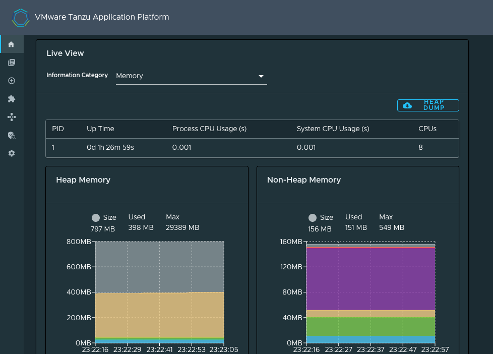

# OpenLegacy Hub CICS demo on Tanzu Application Platform

## Assumptions

A *nix compatible environment with a `bash` shell

## Pre-requisites

1. A [Tanzu Application Platform 1.3.x](https://network.tanzu.vmware.com/products/tanzu-application-platform/) installation.
2. Sign up for the free [OpenLegacy 60 day trial](https://app.ol-hub.com/auth/sign-up)
   - If you need an extendtion beyond 60 days for now contact: [peltgroth@vmware.com](mailto:peltgroth@vmware.com)
3. Java 11 or higher
4. Install [Gradle](https://gradle.org/install/)
5. Install [OpenLegacy CLI](https://hub-support.openlegacy.com/en/install-and-log-in)
6. Clone down this repository.

## Create the OpenLegacy Hub Project

1. Login to [OpenLegacy Hub](https://app.ol-hub.com/)
2. [Generate an OpenLegacy API Key](https://hub-support.openlegacy.com/en/article/generate-api-keys-5957463)
3. Login to [ol cli](https://hub-support.openlegacy.com/en/article/generate-api-keys-5957463): `ol login`
4. From this directory
      1. Allow execute on [ol-project.sh](ol-project.sh): `chmod +x ol-project.sh`
      2. Run `./ol-project.sh` to create the demo OpenLegacy Module, Assets, and Project.
5. Go to the Project and click **Generate Service**

1. Select SPRING-JAVA-REST

1. Download the Service

1. Unzip: `unzip <my-project>.zip -d <destination-directory>`
2. `cd` into the unzipped destination directory
3.  Optional: Run `gradle bootRun` and check [localhost:8080/openapi/index.html](localhost:8080/openapi/index.html?url=/openapi/openapi.yaml)


## Deploy into Tanzu Application Platform

Note: This deploys into the `default` Kubernetes namespace.

```bash
tanzu app wld apply demo-ol-cics \ # Or replace demo-ol-cics with your name
--local-path . \
--source-image <destimation image repository, e.g. my.azurecr.io/supply-chain/cics-demo> \
--type web \
--app ol-tap-demo \
--annotation autoscaling.knative.dev/minScale=1 \
--label apis.apps.tanzu.vmware.com/register-api="true" \
--param-yaml api_descriptor='{"type":"openapi","description":"Open Legacy generated CICS APIs.","owner":"demo-team","system":"ol-tap-demo","location":{"path":"/openapi/openapi.yaml"}}'
```
## Add the Catalog
1. See [Add your application to the Tanzu Application Platform GUI software catalog](https://docs.vmware.com/en/VMware-Tanzu-Application-Platform/1.3/tap/GUID-getting-started-deploy-first-app.html#add-your-application-to-tanzu-application-platform-gui-software-catalog-3).
2. For the **Repository URL** use: `https://github.com/PeterEltgroth/ol-tap-demo/blob/main/catalog/catalog-info.yaml`
3. After registering return to the home page to confirm registration.


## Results in TAP GUI

### Supply Chain


### API Explorer


### API Definition

Note: To enable **TRY IT OUT** the application must have [CORS set to allow requests from TAP GUI](https://docs.vmware.com/en/VMware-Tanzu-Application-Platform/1.3/tap/GUID-api-auto-registration-usage.html#setting-up-cors-for-openapi-specifications-5). If CORS is not configured the OpenAPI can be tried directly from the application, for example: `https://demo-ol-cics.<namespace>.<my-domain>/openapi/index.html`


### Component

### Application Live View

[Application Live View docs](https://docs.vmware.com/en/VMware-Tanzu-Application-Platform/1.3/tap/GUID-app-live-view-about-app-live-view.html)

From the ol-tap-demo Component:
1. Click the **Runtime Resources** tab
2. Click the *Running* pod name, for example `demo-ol-cics-00001-deployment-58ff97468f-69986`
3. Scroll down to the **Live View** section.

### Details


### Available Categories


### Health

#### Memory


#### Log Levels

## References

- [OpenLegacy Public Hub Demos Repo - CICS samples](https://github.com/openlegacy/openlegacy-public-hub-demos/tree/master/mainframe-cics)
- [OpenLegacy TAP Proof-of-Concept CICS repo](https://github.com/PeterEltgroth/account-cics-microservice)